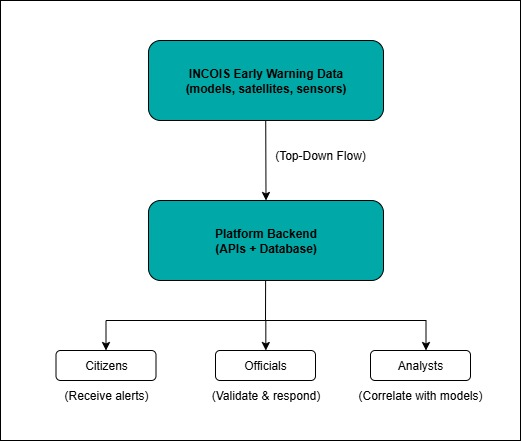
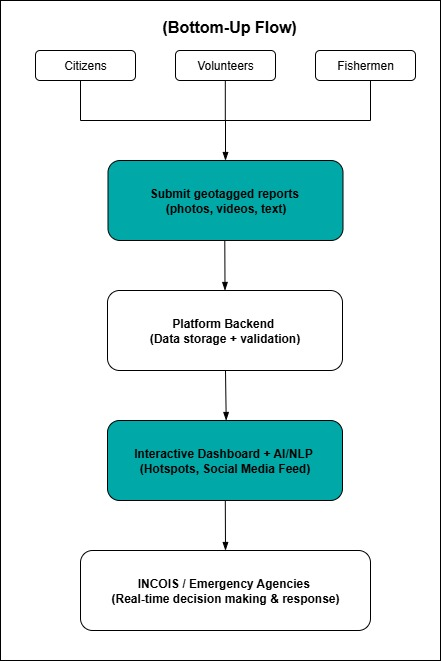
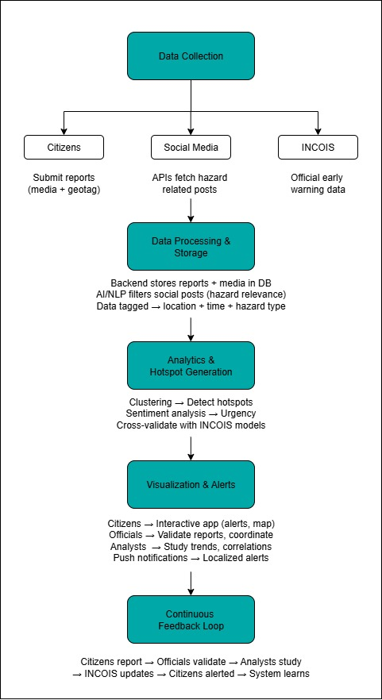

# 🌊 Integrated Platform for Crowdsourced Ocean Hazard Reporting and Social Media Analytics

## 📌 Overview
This project proposes an **integrated software platform (mobile + web)** that empowers citizens, coastal communities, and disaster management authorities by combining **crowdsourced hazard reporting, social media analytics, and INCOIS early warning models**.

It is developed under:

**Organization**: [Ministry of Earth Sciences (MoES)](https://www.moes.gov.in)  
**Department**: [Indian National Centre for Ocean Information Services (INCOIS)](https://incois.gov.in)  
**Theme**: [Disaster Management](https://ndma.gov.in)

---

## 🏛️ About INCOIS
The **Indian National Centre for Ocean Information Services (INCOIS)**, operating under the administrative control of the **Ministry of Earth Sciences**, provides **ocean information and advisory services** to support disaster risk reduction and ensure maritime safety for coastal stakeholders.  

Its early warning services cover hazards such as **tsunamis, storm surges, high waves, swell surges, and coastal currents**, enabling authorities and communities to make informed decisions during ocean-related emergencies.

---

## 🌍 Background
India’s **7,500+ km coastline** is vulnerable to a range of ocean hazards such as **tsunamis, storm surges, high waves, coastal currents, and abnormal sea behaviour**.  

While agencies like **INCOIS** provide early warnings based on **satellite data, sensors, and numerical models**:  
- **Real-time field reporting from citizens and local communities** is often unavailable or delayed.  
- **Valuable insights from social media discussions** during hazard events remain untapped, even though they are critical for understanding **ground realities, public awareness, and misinformation spread**.

---

## 📝 Detailed Description
There is a need for a **unified platform** that enables citizens, coastal residents, volunteers, and disaster managers to report observations during hazardous ocean events (e.g., unusual tides, flooding, coastal damage, tsunami, swell surges, high waves, etc.) and to monitor public communication trends via social media.  

This platform should:
- Allow citizens to submit **geotagged reports, photos, or videos** of observed ocean hazards via a mobile/web app.  
- Support **role-based access** for citizens, officials, and analysts.  
- Aggregate and visualize **real-time crowdsourced data** on a dynamic dashboard.  
- Visualize all crowdsourced reports and social media indicators on an **interactive map**, with **hotspots dynamically generated** based on report density, keyword frequency, or verified incidents.  
- Integrate **social media feeds** (e.g., Twitter, public Facebook posts, YouTube comments) and apply **NLP/Text Classification** to extract hazard-related discussions and trends.  
- Help emergency response agencies understand the **scale, urgency, and sentiment** of hazard events.  
- Provide **filters by location, event type, date, and source**, enabling better situational awareness and faster validation of warning models.  

---

## 🎯 Expected Solution
An **integrated software platform (mobile + web)** with:  
- ✅ **User registration and reporting interface** with media upload.  
- ✅ **Map-based dashboard** showing live crowd reports and social media activity.  
- ✅ **Dynamic hotspot generation** based on report volume or verified threat indicators.  
- ✅ **Backend database and API** for data management and integration with early warning systems.  
- ✅ **NLP engine** for detecting hazard-related posts, keywords, and engagement metrics.  
- ✅ **Multilingual support** for regional accessibility.  
- ✅ **Offline data collection capabilities** (sync later), useful for remote coastal areas.  

---

## 🚨 Problem Statement
India’s 7,500+ km coastline is highly vulnerable to **tsunamis, cyclones, storm surges, high waves, swell surges, and rip currents**.  
While **INCOIS** provides early warnings using **satellites, buoys, sensors, and models**, there are gaps:
- **Ground-truth citizen reports are missing or delayed.**
- **Social media insights remain untapped**, even though people share real-time hazard updates.
- **Top-down warning system** with weak feedback from citizens → delayed response & reduced situational awareness.

---

## 💡 Proposed Solution
A **unified mobile + web platform** that:
- Allows citizens to submit **geotagged hazard reports with photos/videos** (offline sync supported).
- Integrates **social media analytics** (Twitter, Facebook, YouTube) using **NLP/AI**.
- Provides **role-based dashboards** for citizens, officials, and analysts.
- Visualizes real-time reports & hotspots on an **interactive map**.
- Builds a **continuous feedback loop**: Citizens → Officials → Analysts → INCOIS → Citizens.

  
  

  <b>Figure:</b> Left – Current Top-Down Approach | Right – Proposed Bottom-Up Approach

---

## 🔄 Methodology & Implementation Process (Flow)

The system follows a step-by-step workflow combining **citizen reporting, social media analytics, and INCOIS early warning models**.

---

## 📱 Features

### 👨‍👩‍👦 Citizen App
- User registration & multilingual profiles.  
- Submit **hazard reports** (photo, video, text, geotag, offline sync).  
- Receive **real-time alerts & notifications**.  
- Interactive **map of nearby hazards**.  
- Upvote/flag reports, SOS emergency button, awareness guides.  

### 🛡️ Officials Dashboard
- Validate and prioritize citizen reports.  
- Monitor **hotspots & urgency levels**.  
- Push **official alerts** to citizens.  
- Coordinate **rescue & relief resources**.  
- Maintain **audit logs** of decisions.  

### 📊 Analysts Dashboard
- Aggregate **citizen reports + INCOIS + social media**.  
- NLP-powered **hazard classification, sentiment, misinformation detection**.  
- Hotspot clustering & urgency analysis.  
- Historical trend analysis & reports.  
- API integration with INCOIS/NDMA systems.  

---

## 🛠️ Tech Stack
- **Frontend**: Flutter (mobile & web), Google Maps API / Mapbox  
- **Backend**: Node.js + Express.js, GraphQL (optional)  
- **Database**: PostgreSQL / MongoDB  
- **AI/NLP**: Transformers (BERT, IndicBERT), TensorFlow/PyTorch  
- **Infrastructure**: AWS/GCP, Docker, Kubernetes, ElasticSearch  
- **Messaging**: Firebase Cloud Messaging, Twilio/SMS gateways  
- **Security**: OAuth2, JWT, encrypted APIs  

---

## ✅ Feasibility Analysis

- **Technical Feasibility**: Proven NLP + crowdsourcing models, cloud-ready backend, offline-first design.  
- **Financial Feasibility**: Cost-effective with open-source + scalable cloud deployment.  
- **Organizational Feasibility**: Fits INCOIS & MoES mandate, easy citizen adoption via mobile app.  

### 🚧 Challenges & Risks
- Data reliability (false citizen reports).  
- Social media misinformation.  
- User adoption in remote coastal areas.  
- High data load during disasters.  
- Privacy & security concerns.  

### 🛡️ Mitigation Strategies
- Credibility scoring & cross-validation with INCOIS.  
- AI/NLP misinformation detection.  
- Multilingual UI, awareness campaigns, gamification.  
- Cloud auto-scaling & offline sync.  
- Strong encryption & access control.  

---

## 🌍 Impact & Benefits

### Potential Impact
- **Citizens**: Faster alerts, empowerment through active reporting.  
- **Officials**: Real-time ground intelligence for quicker rescue.  
- **Analysts**: Rich datasets improve hazard models.  
- **Policy Makers**: Data-driven disaster planning, improved trust.  

### Benefits
- **Social**: Builds resilient, aware communities.  
- **Economic**: Reduces disaster losses (lives, fisheries, tourism).  
- **Environmental**: Protects coastal ecosystems with faster response.  
- **Technological**: AI-powered, scalable, multilingual, globally replicable.  

---

## 🚀 Roadmap

The project will be developed in **three major phases**, each building on the previous one.  
This ensures **agile, iterative progress** with continuous feedback from stakeholders.

---

### **Phase 1 – Prototype (MVP)**  
🎯 Goal: Establish the foundation with citizen reporting and a basic dashboard.

- ✅ Mobile app for citizens (Flutter, Android/iOS).  
  - User registration, multilingual support.  
  - Submit hazard reports (photo, video, text, geotag).  
  - Offline-first reporting (sync when online).  
- ✅ Basic web dashboard for officials.  
  - View and validate citizen reports.  
  - Push alerts/notifications to users.  
- ✅ Database + backend setup (Node.js/Express, MongoDB/PostgreSQL).  
- ✅ Cloud deployment (AWS/GCP).  

📌 **Deliverable:** A working MVP for citizen reporting + official validation.

---

### **Phase 2 – AI/NLP Integration**  
🎯 Goal: Leverage social media & AI for real-time insights.

- 🔹 Social media data ingestion (Twitter/X, Facebook, YouTube APIs).  
- 🔹 NLP/AI pipeline for:  
  - Hazard classification.  
  - Sentiment analysis (panic vs awareness).  
  - Misinformation & rumor detection.  
- 🔹 Real-time hazard clustering & hotspot visualization on map.  
- 🔹 Enhanced official dashboard with prioritization tools.  
- 🔹 Citizen app enhancements:  
  - Interactive hazard map.  
  - Upvote/flag reports.  
  - Awareness material (safety guides, do’s & don’ts).  

📌 **Deliverable:** AI-powered dashboards + integrated citizen/social media hazard feeds.

---

### **Phase 3 – Full Deployment & Scaling**  
🎯 Goal: Create a production-ready, large-scale, resilient system.

- 🚀 INCOIS model integration (tsunami, cyclone, storm surge data).  
- 🚀 Multi-language support across all India’s coastal languages.  
- 🚀 Advanced features:  
  - SOS emergency button (with location sharing).  
  - Role-based access control (citizens, officials, analysts, admins).  
  - Historical trend analysis + reports for policy makers.  
- 🚀 Secure messaging/alerts via Firebase, SMS (Twilio), WhatsApp API.  
- 🚀 Scalability with Kubernetes/Docker.  
- 🚀 Continuous feedback loop: Citizens ↔ Officials ↔ Analysts ↔ INCOIS.  

📌 **Deliverable:** A fully integrated national platform, production-ready, scalable, and replicable globally.

---

### **Long-Term Vision**  
- 🌍 Replication for other coastal nations.  
- 📡 IoT & satellite data integration.  
- 🤖 AI-driven predictive hazard modeling.  
- 🛰️ Partnerships with global organizations (UNDRR, IOC-UNESCO, WMO).  
- 🎓 Community gamification (hazard reporting rewards, awareness drives).  

---

## 🤝 Contribution
We welcome contributions from researchers, developers, and volunteers passionate about **disaster risk reduction**.  
- Fork the repo  
- Create a feature branch  
- Submit a pull request  

---

## 📜 License
This project is licensed under the [MIT License](./LICENSE.txt). – feel free to use, modify, and distribute with proper attribution.  

---
